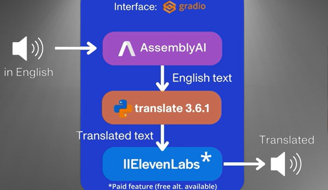

# 🎤 VocalBridge : A Voice Translator App

Welcome to **VocalBridge**, an app designed to break language barriers with ease. Using **Gradio**, **AssemblyAI**, and **ElevenLabs**, it allows you to record or upload your voice, transcribe it, translate into multiple languages, and then convert it back to speech, all within a beautiful, user-friendly interface.

## 📚 Table of Contents

1. [Prerequisites](#prerequisites)
2. [Problem Definition](#problem-definition)
3. [Solution Provided](#solution-provided)
4. [Features](#features)
5. [How It Works](#how-it-works)
   - [Website Overview](#website-overview)
6. [Getting Started](#getting-started)
   - [Setup and Installation](#setup-and-installation)
   - [Running the Project](#running-the-project)
7. [Technologies Used](#technologies-used)
8. [Dependencies](#dependencies)
9. [Contributing](#contributing)

## Prerequisites🛠️

Before setting up and running the project, ensure you have the following:

1. **Python 3.7+**: Make sure Python 3.7 or higher is installed on your machine.
   - Download and install from [Python Official Site](https://www.python.org/downloads/).
2. **Git**: Required for cloning the repository.
   - Download and install from [Git Official Site](https://git-scm.com/downloads).
3. **API Keys**: Obtain API keys for the following services:
   - **AssemblyAI**: [Get API Key](https://www.assemblyai.com/?utm_source=...)
   - **ElevenLabs**: [Get API Key](https://elevenlabs.io/)
4. **Virtual Environment (Optional but Recommended)**: 
   - For managing project dependencies separately from your system Python installation.
   - Instructions for setting up a virtual environment can be found [here](https://docs.python.org/3/library/venv.html).
5. **Internet Connection**: Required for downloading dependencies and accessing APIs.

##  Problem Definition📝

- **Language Barriers**: Difficulty in communicating across multiple languages.
- **Transcription Accuracy**: Need for precise conversion of spoken words to text.
- **Translation Challenges**: Efficiently translating text into various languages while maintaining meaning.
- **Speech Generation**: Producing natural-sounding audio from translated text.
- **User Interface**: Creating an intuitive interface for recording, translating, and playing audio.

##  Solution Provided💡
**VocalBridge** addresses this by offering:
1. Real-time **audio transcription**.
2. **Multi-language translations** for the transcribed text.
3. Speech generation from translations in a variety of supported languages.
4. Downloadable **audio outputs** for easy access and sharing.

##  Features⚙️
- 🎙️ **Voice Recording & Uploading**: Record directly from your microphone or upload existing audio.
- 🌐 **Multi-language Translation**: Translate your voice into a wide range of supported languages.
- 🔊 **Text-to-Speech in Multiple Languages**: Get audio outputs in your chosen languages.
- 📈 **Real-time Progress Tracking**: Keep an eye on the status of your transcription and translation tasks.
- 🌟 **Sleek UI**: A modern, customizable interface with a waveform player.

##  How It Works🌐



### Website Overview
- **Homepage**: Introduction to VocalBridge with a user-friendly interface.
- **Voice Recording**: Option to record or upload audio files.
- **Language Selection**: Choose from a variety of languages for translation.
- **Audio Playback**: Listen to the translated audio outputs directly on the website.

##  Getting Started🚀
   
###  Setup and Installation🛠️
1. **Clone the Repository**:
   ```bash
   git clone https://github.com/kittu-122/VocalBridge.git
   cd VocalBridge
   ```

2. (Optional) Create a Virtual Environment:
    ```bash
   python -m venv venv
   venv/bin/activate  
   ```

3. Install Dependencies
   ```bash
   pip install -r requirements.txt
   ```
   
###  Running the Project🎯
1. Run the Gradio App:
   ```bash
   python {replace with file name}.py
   ```
2. Access the App: Open http://localhost:7860 in your browser to start using VocalBridge.

##  Technologies Used🛠️

This project leverages the following libraries and tools:

- **AssemblyAI**: [API Documentation](https://www.assemblyai.com/docs/)
- **ElevenLabs**: [API Documentation](https://elevenlabs.io/docs/introduction)
- **Gradio**: [Quickstart Guide](https://www.gradio.app/guides/quickstart)
- **Translator Library**: [Documentation](https://translate-python.readthedocs.io/en/latest/)

##  Dependencies📦
- `assemblyai`
- `translate`
- `elevenlabs`
- `gradio`
- `pydantic`
- `numpy`
- `uuid`
- `pathlib`

## Contributing
- We're are open to enhancements & bug-fixes.
- Feel free to add issues and submit patches.

**Happy coding!** 🚀
**Thank you for choosing this project. Hoping that this project proves useful and delivers a seamless experience for your needs!**
